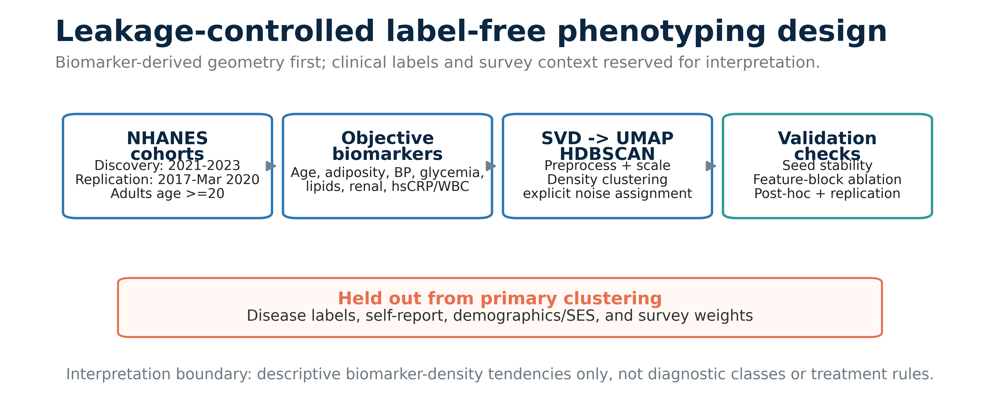
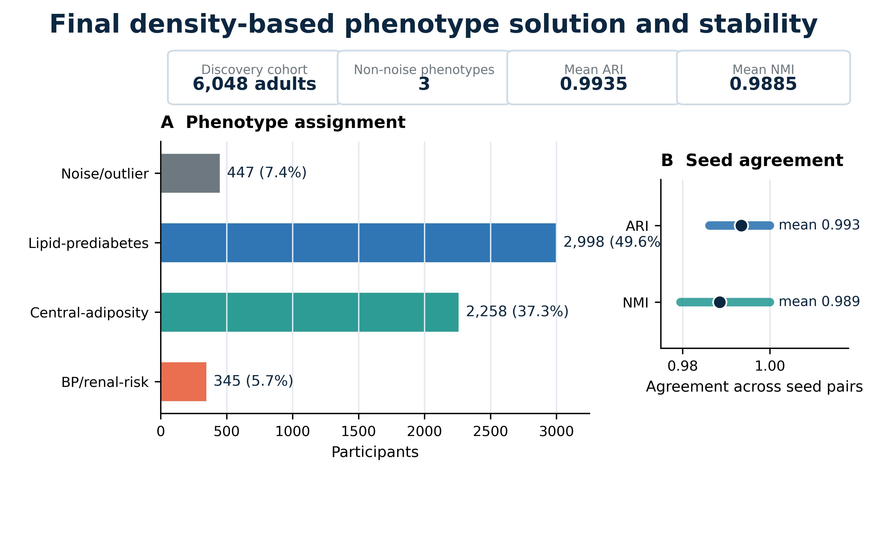
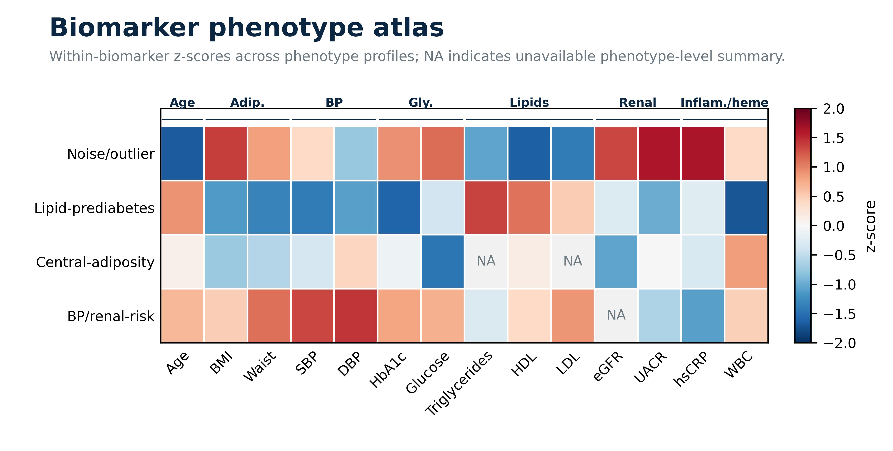
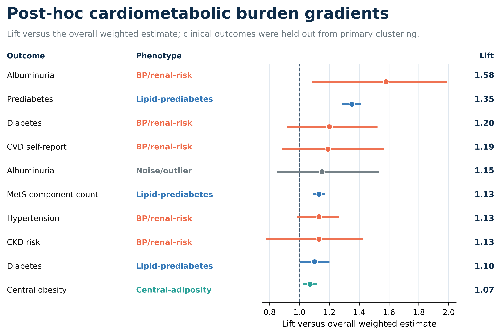
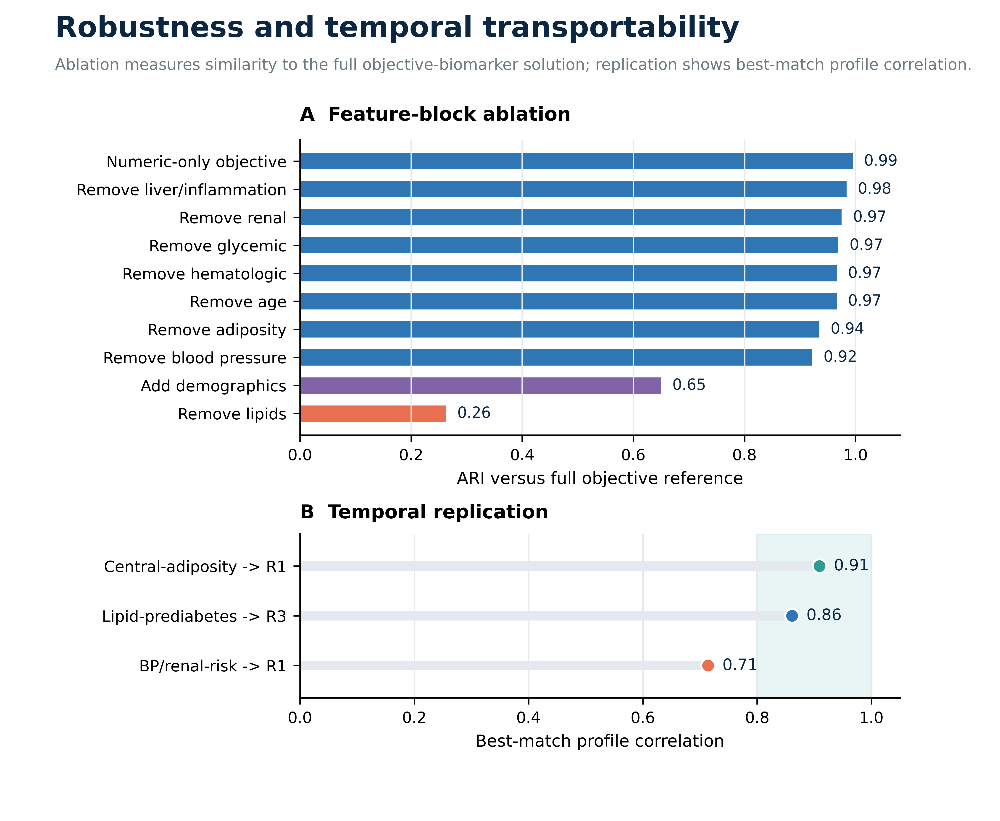

# NHANES-HDBSCAN cardiometabolic phenotyping

[](https://github.com/KrishnaSaiPokala/nhanes-hdbscan-phenotyping/actions/workflows/ci.yml)
[](LICENSE)
[](pyproject.toml)

Reproducible research software and aggregate reporting artifacts for label-free cardiometabolic biomarker phenotyping in US adults using public NHANES data.

This repository supports the preprint manuscript **Stable label-free cardiometabolic biomarker phenotypes in US adults**. The analysis identifies and stress-tests exploratory biomarker-density phenotypes using objective examination and laboratory biomarkers, while keeping disease labels, self-reported diagnoses, survey weights, demographic variables, and socioeconomic variables out of the primary clustering feature space.

## Headline result

| Quantity | Value |
|---|---:|
| Discovery cohort | 6,048 adults |
| Primary solution | 3 non-noise HDBSCAN phenotypes plus algorithmic noise/outlier group |
| Mean noise rate | 7.10% |
| Mean non-noise silhouette | 0.9168 |
| Mean pairwise adjusted Rand index | 0.9935 |
| Mean pairwise normalized mutual information | 0.9885 |
| Selected SVD / UMAP configuration | 75 requested SVD components; 10 UMAP components; 50 neighbors |
| Selected HDBSCAN configuration | minimum cluster size 300; minimum samples 50 |
| Strongest ablation finding | lipid-domain removal was the most destabilizing perturbation |
| Temporal replication summary | best discovery-to-replication profile correlations ranged from 0.714 to 0.909 |

## Interpretation boundary

The phenotype labels are descriptive summaries of biomarker-density patterns. They are **not** diagnostic classes, causal subtypes, treatment strata, or a clinical decision tool. Post-hoc disease-burden enrichment is reported only after the biomarker-derived phenotype solution is frozen.

## Final preprint files

The medRxiv-ready files are stored under [`preprint/medrxiv/v1/`](preprint/medrxiv/v1/):

- [`Pokala_NHANES_HDBSCAN_Manuscript.pdf`](preprint/medrxiv/v1/Pokala_NHANES_HDBSCAN_Manuscript.pdf)
- [`Pokala_NHANES_HDBSCAN_Supplementary_Material.pdf`](preprint/medrxiv/v1/Pokala_NHANES_HDBSCAN_Supplementary_Material.pdf)

## Key figures

### Study design and leakage control



### Final phenotype solution and stability



### Biomarker phenotype atlas



### Post-hoc cardiometabolic burden gradients



### Robustness and temporal transportability



## Repository map

| Path | Purpose |
|---|---|
| `src/nhanes_hdbscan/` | Research utilities for result parsing, reporting, visualization, and reproducibility checks |
| `scripts/` | Command-line entry points for aggregate report generation and repository checks |
| `results/summary/` | Final aggregate result object and plain-language result memory |
| `tables/curated/` | Human-readable curated CSV/PDF tables used in the submission package |
| `figures/main/` | Main text figures in PNG/PDF/SVG form |
| `figures/extended/` | Extended-data and supplementary figures |
| `preprint/medrxiv/v1/` | medRxiv-ready manuscript and supplementary material PDFs |
| `docs/` | Data availability, leakage-control notes, limitations, reproducibility notes, and release audit |
| `metadata/` | Copy-paste medRxiv form text and abstract |

## Quick start

```bash
python -m pip install --upgrade pip
python -m pip install -r requirements.txt
python scripts/make_research_report.py
python -m pytest -q
```

The aggregate reporting workflow uses `results/summary/nhanes_hdbscan_results_v2_plus.json` by default. Raw NHANES source files are not committed to this repository.

## Data availability

Raw NHANES public-use data are available from the National Center for Health Statistics / Centers for Disease Control and Prevention:

- NHANES August 2021-August 2023: https://wwwn.cdc.gov/nchs/nhanes/continuousnhanes/default.aspx?Cycle=2021-2023
- NHANES 2017-March 2020 pre-pandemic: https://wwwn.cdc.gov/nchs/nhanes/continuousnhanes/default.aspx?Cycle=2017-2020

This repository provides code, aggregate derived tables, figures, and reporting artifacts. It does not redistribute raw NHANES source files.

## Reproducibility status

This repository is intended to support reviewer and reader audit of aggregate reporting artifacts. The primary manuscript reports a final selected configuration and a stability-first evaluation design. Full local reconstruction requires obtaining raw NHANES XPT files directly from NCHS/CDC and running the analysis environment locally.

## Citation

If this repository is useful, please cite the repository metadata in [`CITATION.cff`](CITATION.cff). After a medRxiv DOI is assigned, update the citation section with the DOI and version-specific preprint URL.

## License

Code is released under the MIT License. See [`LICENSE`](LICENSE). The manuscript/preprint PDF and figures may have separate reuse terms depending on the selected medRxiv license.
