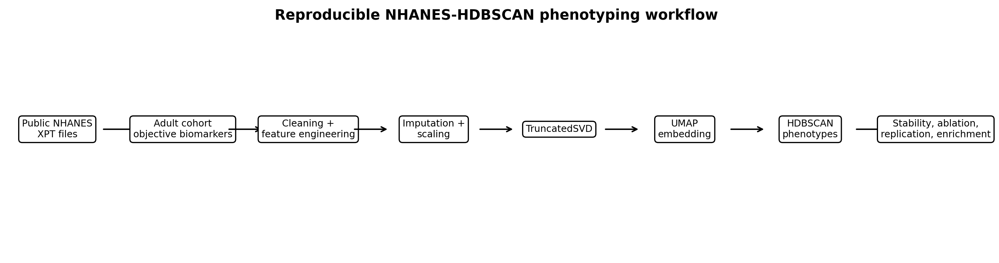
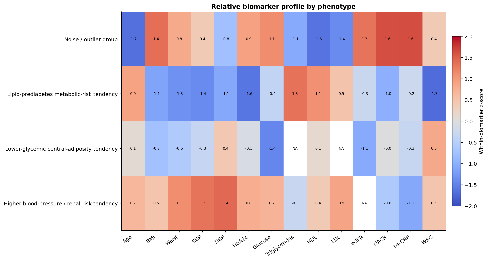
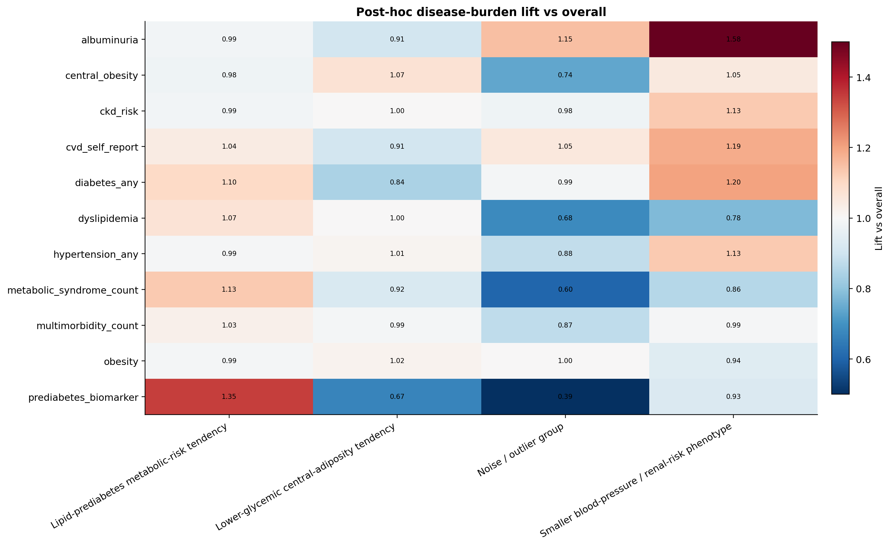
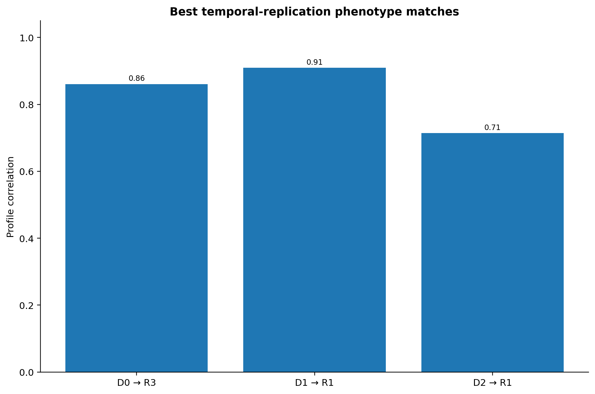

# NHANES-HDBSCAN Cardiometabolic Phenotyping

[](https://github.com/KrishnaSaiPokala/nhanes-hdbscan-phenotyping/actions/workflows/ci.yml)
[](https://github.com/KrishnaSaiPokala/nhanes-hdbscan-phenotyping/releases)
[](LICENSE)
[](pyproject.toml)

Reproducible research software for unsupervised cardiometabolic biomarker phenotyping in U.S. adults using public NHANES data.

## Overview

This repository provides a modular, test-covered research-software implementation for summarizing and reproducing aggregate outputs from an NHANES-HDBSCAN cardiometabolic phenotyping analysis. The workflow derives exploratory biomarker-based phenotypes from objective examination and laboratory measurements, then evaluates stability, feature-block ablations, post-hoc disease-burden enrichment, and temporal replication.

Disease labels, survey weights, and demographic or socioeconomic variables are not used to form the primary clustering solution. They are used only after clustering for interpretation and descriptive enrichment.

## Results at a glance

| Quantity | Value |
|---|---:|
| Discovery cohort | 6,048 adults |
| Non-noise phenotypes | 3 |
| Noise / outlier group | 447 participants (7.10%) |
| Mean non-noise silhouette | 0.9168 |
| Mean pairwise ARI | 0.9935 |
| Mean pairwise NMI | 0.9885 |
| HDBSCAN min cluster size | 300 |
| HDBSCAN min samples | 50 |
| SVD / UMAP components | 75 / 10 |

## Workflow

```text
Public NHANES XPT files
→ adult analytic cohort and objective biomarkers
→ cleaning, feature engineering, imputation, and scaling
→ TruncatedSVD representation
→ UMAP embedding
→ HDBSCAN density-based phenotyping
→ stability, ablation, enrichment, replication, and reporting
```



## Key figures

### Relative biomarker profiles



### Post-hoc disease-burden enrichment



### Temporal replication



## Quick start

```bash
python -m pip install -r requirements.txt
python scripts/make_research_report.py
python -m pytest -q
```

Generated outputs are written to:

- `figures/` — manuscript-ready visual summaries
- `tables/` — normalized aggregate CSV tables
- `docs/research_results_summary.md` — concise research-results summary
- `manuscript/results_scaffold.md` — manuscript results starting point
- `results/summary/technical_summary.md` — technical summary

## Repository map

| Path | Purpose |
|---|---|
| `src/nhanes_hdbscan/` | Modular research utilities for data access, preprocessing, embedding, clustering, stability, ablation, enrichment, replication, visualization, and reporting |
| `scripts/` | Command-line entry points for report generation and local run-readiness checks |
| `configs/` | Small reproducibility configuration stubs for discovery, replication, and smoke-test workflows |
| `tables/` | Committed aggregate tables derived from the final results JSON |
| `figures/` | Committed figures generated from aggregate outputs |
| `docs/` | Research summaries, reproducibility notes, and analysis inventory |
| `manuscript/` | Manuscript-oriented results scaffold |
| `tests/` | Unit tests for core utility functions and result parsing |

## Scientific scope

This study should be interpreted as exploratory unsupervised phenotyping. The phenotype labels are descriptive summaries of biomarker patterns; they are not diagnostic classes, causal subtypes, or a clinical decision tool. Post-hoc enrichment analyses are descriptive and should not be interpreted causally.

Raw NHANES files are not redistributed. Users who wish to run full local analyses should obtain source files directly from NHANES and adapt local paths accordingly.

## Citation

If this repository or derived aggregate outputs are useful, please cite the software metadata in [`CITATION.cff`](CITATION.cff).

## License

This repository is released under the MIT License. See [`LICENSE`](LICENSE).
